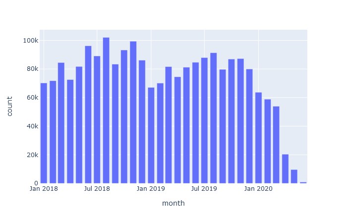

# Lessons Learned

## Dash

### 1. Adding Dash into an existing Flask app

I followed [this helpful tutorial.](https://www.notion.so/insurami/Add-Dash-into-app-e3ff60b36db84cfbbaa03d0221107099#c467b44650f04efd9e318411b3d6bad6) Key points were to use the application factory pattern to initialise the app, so that the Dash server launches on the existing flask server. This method will make it easier to launch multiple different dash apps on the flask server if required.

### 2. Passing params into Dash from Flask

In this app, users input a postcode on the first page (ie. in `flask` ), which is validated through the `postcodes.io` api. To pass the first half of this (the incode) into Dash I did the following:

* Saved `incode` to the flask session
* Registered a Dash app at `/dashapp1/`
* Appended the incode to the url for the Dash app on `postcode_info.html` : `{{ url_for('/dashapp1/') + '#' + session.incode }}`
* Added `Location` component to the Dash layout to access the url: `dcc.Location(id="incode", refresh=True)`
* Specify that the callback for this app is on the url refreshing, and access just the hash element of the url: `[Input("incode", "hash")]`
Important that the tag (incode) matches between the Location and Input classes. Refresh needs to be set in Location so that the callback is triggered when the page is launched.

### 3. Import dataset as a global variable

Do this at the point of registering Dash app so that it isn't called on every callback. Ie. `df = pd.read_sql("SELECT * FROM SALE", db.session.bind,)` at the top of `callbacks.py`

## Data

### 1 Distribution of sales from 2018 - mid2020

### 2 Postcode matching

| Postcode | EPC key            | Land reg. key                | matched     |
|----------|--------------------|------------------------------|-------------|
| BL6      | address1, postcode | saon, paon, street, postcode | 1263 / 1457 |
| BD18      | address1, postcode | saon, paon, street, postcode | 910 / 1095 |
| BD18      | address1, address2, postcode | saon, paon, street, postcode | 996 / 1095 |
| N19      | address1, address2, postcode | saon, paon, street, postcode | 362 / 644 |
| N19      | address1, address2, postcode | saon, paon, street, postcode | 223 / 644 |

Consoliated into a key that uses both of the epc options above, BL6 goes to 1330 / 1457 matched, so sticking with that for now.
